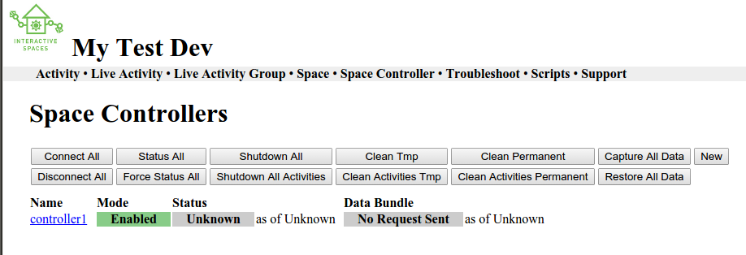

Installing and Updating Smart Spaces
*****************************

Before we can get started, we need to install Smart spaces on a computer.
Installing and updating Smart Spaces is pretty simple.

Installing Smart Spaces
=============================

Installing Smart Spaces from the supplied installers is very easy.

Prerequisites
-------------

Before you can install Smart Spaces on your computer, you should make sure you have Java installed first.

Smart Spaces requires at least Java 1.7.

Installing a Local Master
-------------

Installing a master is pretty easy. You will run an installer activity, and finally test your installation.

.. _installing-the-master:

Installing the Master
~~~~~~~~~~~~~~~~~~~~~

If you are using a graphical user interface system, find the icon for the Smart Spaces Master
installer and double click on it. The installer is a Java jar file.

If you are using a command line interface for your operating system, but still have a graphical
user interface, use the command

::

  java -jar smartspaces-master-installer-x.y.z.jar

where ``x.y.z`` is the version of the Smart Spaces Master you are installing.

If  you want to install without using the graphical installer, use the command

::

  java -jar smartspaces-master-installer-x.y.z.jar -console

For now just accept all of the default settings by clicking Next on the configuration page.

Testing the Master Installation
~~~~~~~~~~~~~~~~~~~~~~~~~~~~~~~

To test if your installation happened correctly, open up a command shell and go to the directory where you installed the master. Once there, type the command

::

  bin/smartspaces

You should see a bunch of text scroll by as the master starts up. When you see no more text going by, go to a web browser and go to

::

  http://localhost:8080/smartspaces

If everything installed correctly you should be seeing the Master Web Interface in your browser.

You can shutdown the master by typing the command ``shutdown`` into the command shell where you
started running the master. You can also type ``^D`` where the ``^`` means the Control key on
your keyboard.

Installing a Local Controller
-----------------------------

Installing a controller is pretty easy if you chose to let the controller autoconfigure itself. You will run an installer activity, and finally test your installation.

You can also manually configure the controller, though there usually isn't a good reason for this.

Installing the Controller
~~~~~~~~~~~~~~~~~~~~~~~~~

If you are using a graphical user interface system, find the icon for the Smart Spaces Space Controller
installer and double click on it. The installer is a Java jar file.

If you are using a command line interface for your operating system, but still have a graphical
user interface, use the command

::

  java -jar smartspaces-controller-installer-x.y.z.jar

where ``x.y.z`` is the version of the Smart Spaces Master you are installing.

If  you want to install without using the graphical installer, use the command

::

  java -jar smartspaces-controller-installer-x.y.z.jar -console

For now just accept all of the default settings by clicking Next on the configuration page.

If you want your setup to match the pictures we will have in this manual, please name your controller 
``controller1``.

Testing the Controller Installation
~~~~~~~~~~~~~~~~~~~~~~~~~~~~~~~~~~~

To test if your installation happened correctly, first make sure you have a Master started. Then
open up a command shell and go to the directory where you installed the controller.
Once there, type the command

::

  bin/smartspaces

You should see a bunch of text scroll by as the controller starts up.

Go to the Master Web Interface in your browser. The URL is

::

  http://localhost:8080/smartspaces

Go to the Controller menu. You should see an entry with the name of the controller you created.
Click on this and click Connect. If everything is working you should see

::

  New subscriber for controller status

appear in the controller window. Also, if you refresh the controller page in the Master Web
Interface you should see it say that the controller is in the running state.

You can shutdown the controller by typing the command ``shutdown`` into the command shell where you
started running the controller. You can also type ``^D`` where the ``^`` means the Control key on
your keyboard.

Manually Configuring a Controller
~~~~~~~~~~~~~~~~~~~~~~~~~~~~~~~~~

This is an advanced topic and is not normally done. Only do this if you really have no other
choice.

Before you install a manually configured controller, you need a UUID for the controller.

You can get this by creating a new controller in the Master webapp. Click on the
**Space Controller** menu,
then *New*. Decide on a Host ID for the controller. The Controller Name you use is only for the
master, pick something descriptive for the controller. Then click *Save*. The master will create a
UUID for the controller and display it in the next screen.

You will enter both the controller Host ID and UUID during the controller installation when
prompted. Be sure to chose the manually configured option during installation.

Installing the Workbench
------------------------

The Smart Spaces Workbench provides you with example code, documentation, and the
Workbench application which can help you maintain and deploy your activities.

If you are using a windowing system, find the icon for the Smart Spaces Controller
installer and double click on it. The installer is a Java jar file.

If you are using a command line interface for your operating system, use the command

::

  java -jar smartspaces-workbench-installer-x.y.z.jar

where ``x.y.z`` is the version of the Smart Spaces Workbench you are installing.

Updating An Installation
========================

Updating an installation is currently more complicated than it needs to be,
but that will change soon.

Delete the contents of the following folders in your master and in all of
your controllers and workbenches.

1. bootstrap
2. lib/system/java

Also delete the file *smartspaces-launcher-x.y.z* from the root folder
of each master, controller, and workbench, where *x.y.z* was the version
of the launcher that was there before the update.

Once you have done this, you can upgrade the same way you install.

Advanced Installation
=====================

It is possible to start SmartSpaces masters and controllers on system boot.

SmartSpaces has support for both the systemd service or SystemV init tools.

Using systemd Installation
--------------------------

Suppose you have installed the master in ``/opt/smartspaces/master``.

To enable the master, use the following command.

::

  $ sudo systemctl enable /opt/smartspaces/master/bin/smartspaces-master.service

The master will now start on reboot.

Suppose you have installed the controller in ``/opt/smartspaces/controller``.

To enable the controller, use the following command.

::

  $ sudo systemctl enable /opt/smartspaces/controller/bin/smartspaces-controller.service

The controller will now start on reboot.

You can check the status of a container with, for example, the command

::

  $ sudo systemctl status smartspaces-master.service

You can stop a container with, for example, the command

::

  $ sudo systemctl stop smartspaces-master.service

You can restart a stopped container with, for example, the command

::

  $ sudo systemctl start smartspaces-master.service

To remove a container, use the following command.

::

  $ sudo systemctl disable smartspaces-controller.service

Using SystemV Init Tools Installation
--------------------------

Suppose you have installed the master in ``/opt/smartspaces/master``.

To enable the master, use the following command.

::

  $ sudo ln -s /opt/smartspaces/master/bin/smartspaces-master-service /etc/init.d
  $ sudo update-rc.d smartspaces-master-service defaults

The master will now start on reboot.

Suppose you have installed the controller in ``/opt/smartspaces/controller``.

To enable the controller, use the following command.

::

  $ sudo ln -s /opt/smartspaces/controller/bin/smartspaces-controller-service /etc/init.d
  $ sudo update-rc.d smartspaces-controller-service defaults

The controller will now start on reboot.

You can check the status of a container with, for example, the command

::

  $ sudo /etc/init.d/smartspaces-master-service status

You can stop a container with, for example, the command

::

  $ sudo /etc/init.d/smartspaces-master-service stop

You can restart a stopped container with, for example, the command

::

  $ sudo /etc/init.d/smartspaces-master-service start

To remove a container, use the following command.

::

  $ sudo update-rc.d -f smartspaces-master-service remove
  $ sudo rm /etc/init.d/smartspaces-master-service
